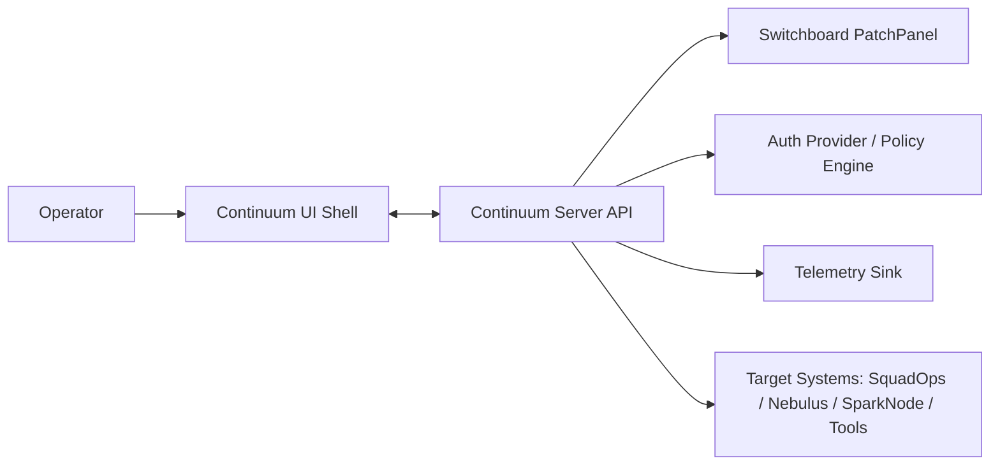
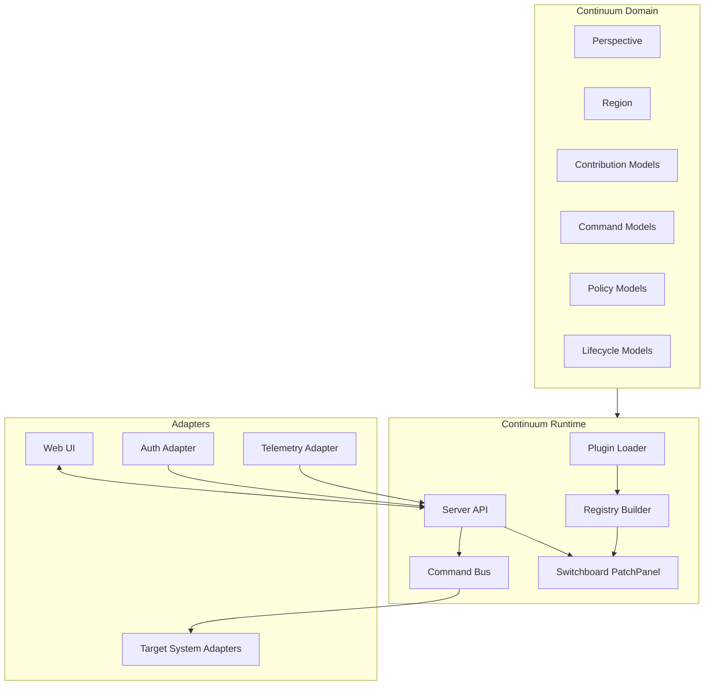
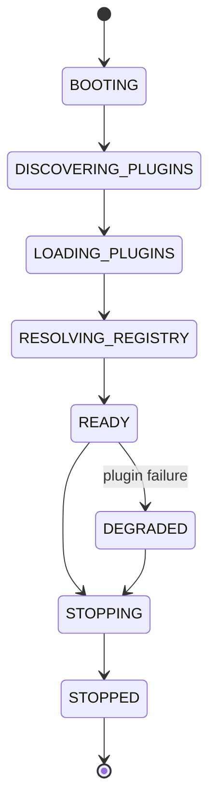
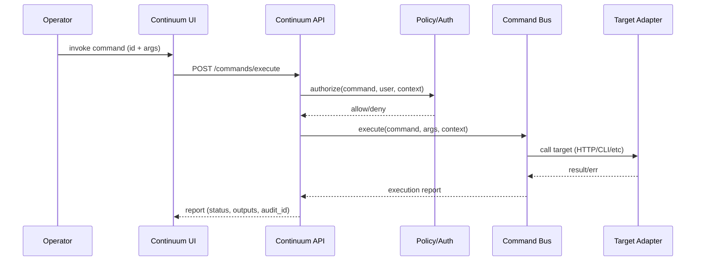

# Continuum V1 Architecture Spec — Control-Plane UI Shell

**Date:** 2026-02-02  
**Status:** Draft (v0.1)  
**Scope:** Architecture spec for Continuum V1 (shell + plugin composition + operational surfaces).  
**Related docs:** `CONTINUUM_INTENT_DOC.md`, `SWITCHBOARD_V1_ARCH_SPEC.md`, `SWITCHBOARD_PATCHPANEL_SLOT_HOOK_ALIGNMENT.md`

---

## 0) Summary

Continuum is a **plugin-driven control-plane UI shell** that composes operational “surfaces” (dashboards, consoles, workflows) into a coherent operator experience behind consistent navigation, auth boundaries, and introspection.

Continuum relies on **Switchboard (PatchPanel)** to provide deterministic registration and resolution of:
- **UI region contributions** (panels, nav, chrome)
- **Command contributions** (operator actions)
- **Lifecycle hooks** (startup/shutdown, diagnostics, telemetry taps)

Continuum V1 is intentionally small and host-owned:
- Continuum defines **Perspectives** and **Regions** (UI anchors).
- Plugins **contribute** panels/commands/nav into those host-defined seams.
- Continuum can always answer: *what’s installed, what’s active, and what’s wired where?*

---

## 1) Goals

1. **Stable operator surface**: Provide a coherent UI “desktop” for managing multiple systems.
2. **Deterministic extensibility**: Add surfaces via plugins without editing Continuum core.
3. **Strong introspection**: Surface plugin status, contributions, and resolution results.
4. **Boundary discipline**: Keep domain logic in underlying systems; Continuum is a shell + adapters.
5. **Safe operations**: Provide a first-class command surface with guardrails and auditable execution.
6. **MECE perspectives**: Support curated work modes (e.g., Signal, Research, Time, Discovery, Systems).

---

## 2) Non-goals (V1)

- A full observability platform (Continuum may embed or link to one).
- A workflow/orchestration engine (Continuum triggers workflows; does not own orchestration).
- A CMS or knowledge base product.
- An identity provider (Continuum integrates with one).
- A general “plugin marketplace” (packaging/distribution is minimal in V1).

---

## 3) Definitions and key terms

### 3.1 Continuum Concepts

- **Perspective**: A curated work mode (e.g., Signal/Research/Time/Discovery/Systems).
- **Region**: A fixed-but-responsive UI anchor inside a perspective layout.
- **Panel**: A renderable UI unit contributed into a Region.
- **Command**: An operator action contributed to the command surface (palette, buttons, menus).
- **Surface**: A higher-level grouping of panels + routes + commands that feels like an app.

### 3.2 Switchboard Mapping

Switchboard V1 defines:
- **Slot** = host-defined anchor (cardinality ONE/MANY)
- **Hook** = lifecycle/event interception point
- **PatchPanel** = registry + resolution engine

Continuum V1 uses the term **Region** in UI language, and maps Regions to Switchboard Slots:

- `continuum.region.*` **(Continuum)** == `ui.slot.*` **(Switchboard)**

> Implementation note: the canonical registry identifiers remain Switchboard Slot IDs; “Region” is the UX term used in Continuum UI and docs.

---

## 4) System context

Continuum sits as the operator-facing shell above multiple services.



**Continuum Server API** is the boundary where:
- plugins are discovered/validated/loaded
- contribution registry is resolved
- commands are executed (locally or proxied)
- audit + telemetry events are emitted

---

## 5) High-level architecture

Continuum is split into three logical layers:

1. **Continuum Domain (core)**
   - perspective + region model
   - contribution model (panels/nav/commands)
   - lifecycle + health model
   - policy primitives (capabilities/permissions)

2. **Continuum Runtime (application)**
   - plugin discovery + loading
   - Switchboard PatchPanel wiring
   - command execution pipeline
   - registry API exposed to UI

3. **Continuum Adapters**
   - UI adapter (web app)
   - target-system adapters (HTTP clients, CLIs, message buses)
   - auth adapter
   - telemetry adapter



---

## 6) Deployment model (V1)

Continuum V1 supports a **single-node deployment**:

- One Continuum server process (API + plugin runtime)
- One UI bundle served by the server (or separately hosted behind the same origin)

Plugins are loaded from:
- local filesystem paths (development and single-node installs)
- optional “plugin directory” mount

Distribution/marketplace concerns are out of scope for V1.

---

## 7) Repo and module layout (suggested)

> This is a reference layout; final paths may differ based on existing repo structure.

```
continuum/
  docs/
    CONTINUUM_INTENT_DOC.md
    CONTINUUM_V1_ARCH_SPEC.md
  src/
    continuum/
      domain/
        perspectives.py
        regions.py
        contributions.py
        commands.py
        policy.py
        lifecycle.py
      app/
        runtime.py
        plugin_loader.py
        registry_builder.py
        command_bus.py
        diagnostics.py
      adapters/
        web/
          (frontend project or compiled assets)
        auth/
        telemetry/
        targets/
  plugins/
    sample_signal/
    sample_systems/
  tests/
    test_smoke_registry.py
    test_plugin_lifecycle.py
    test_command_execution.py
```

---

## 8) Domain model

### 8.1 Perspectives and Regions

A Perspective owns a layout composed of Regions.

- Perspective IDs: `continuum.perspective.signal`, `continuum.perspective.systems`, etc.
- Region IDs (Switchboard Slot IDs under the hood): `ui.slot.left_nav`, `ui.slot.main`, etc.

A minimal V1 region set:

- `ui.slot.header` (ONE)
- `ui.slot.left_nav` (MANY)
- `ui.slot.main` (ONE)
- `ui.slot.right_rail` (MANY)
- `ui.slot.footer` (ONE)
- `ui.slot.modal` (MANY)
- `ui.slot.toast_stack` (MANY)

### 8.2 Contribution types

Continuum V1 supports these contribution categories:

1. **PanelContribution**
   - target region slot
   - render descriptor (component key + props)
   - optional route binding (if panel is navigable)
   - ordering metadata (priority, group, weight)

2. **NavContribution**
   - nav group (per perspective)
   - label/icon
   - target route or “activate panel” action

3. **CommandContribution**
   - command id + label
   - input schema (typed parameters)
   - required capabilities/permissions
   - handler binding (local or proxied)

4. **DiagnosticContribution** (optional V1)
   - health checks, “about this plugin”, version info
   - contributes to *Systems* perspective by default

### 8.3 Minimal dataclass sketch (illustrative)

```python
@dataclass(frozen=True)
class PerspectiveSpec:
    id: str
    label: str
    route_prefix: str
    regions: list[str]  # switchboard slot ids

@dataclass(frozen=True)
class PanelContribution:
    id: str
    slot_id: str
    component: str
    props: dict[str, Any]
    priority: int = 100

@dataclass(frozen=True)
class CommandContribution:
    id: str
    label: str
    input_schema: dict[str, Any]
    required_capabilities: list[str]
    handler: "CommandHandlerRef"
```

> Continuum should keep these models Switchboard-native at the seam (IDs, manifests, contributions), and keep UI-framework specifics inside the UI adapter.

---

## 9) Plugin model

### 9.1 Plugin package contents (V1)

A Continuum plugin is a folder/package containing:

- `plugin.toml` or `plugin.yaml` (manifest)
- UI bundle reference (component registry entries)
- optional server-side module (registers contributions + handlers)

Minimum manifest fields:

- `id` (stable)
- `name`
- `version`
- `description`
- `entrypoint` (server-side registration module/function)
- `ui` (component bundle or component keys)
- `capabilities` (what commands it adds or requires)

### 9.2 Registration model

Plugin registration happens by calling a known entrypoint:

1) Continuum loads plugin manifest  
2) Continuum imports plugin entrypoint  
3) Plugin entrypoint registers contributions into PatchPanel:
   - slot contributions for panels/nav/chrome
   - hooks for lifecycle
   - command registrations

This mirrors the Switchboard host/ plugin contract: plugins don’t mutate global state; they register with the PatchPanel.

---

## 10) Runtime lifecycle

Continuum V1 lifecycle states (representative):

- `BOOTING`
- `DISCOVERING_PLUGINS`
- `LOADING_PLUGINS`
- `RESOLVING_REGISTRY`
- `READY`
- `DEGRADED` (non-fatal failures: some plugins failed)
- `STOPPING`
- `STOPPED`

Lifecycle transitions are explicit and produce diagnostics events.



### 10.1 Failure policy (V1)

- Plugin load failures do **not** crash the host by default.
- Failures are captured in:
  - a plugin status list (FAILED/LOADED/DISABLED)
  - a resolved registry report (what is missing / what fell back)
- Continuum enters `DEGRADED` if any plugin fails to load *after* core is usable.

---

## 11) Registry API between server and UI

The UI needs a stable contract to render:

- perspectives
- nav tree
- resolved region contributions
- command palette entries
- plugin status + diagnostics

A minimal registry payload:

```json
{
  "lifecycle_state": "READY",
  "perspectives": [...],
  "regions": {
    "ui.slot.left_nav": [...],
    "ui.slot.main": [...],
    "ui.slot.right_rail": [...]
  },
  "commands": [...],
  "plugins": [...],
  "diagnostics": [...]
}
```

The UI renders from this payload, not from hard-coded plugin imports.

---

## 12) UI composition and routing

### 12.1 Perspective routing

- Each perspective has a route prefix, e.g. `/signal`, `/systems`.
- Nav items activate either:
  - a route (deep link)
  - a panel selection state within a region

### 12.2 Region rendering

For each region slot:
- resolve contributions via PatchPanel (ordered)
- render by component key (looked up in UI component registry)
- apply cardinality rules:
  - `ONE`: choose the first by priority/weight
  - `MANY`: render an ordered list/stack

> Cardinality is enforced at the Switchboard Slot definition layer.

---

## 13) Command surface

Continuum V1 includes a unified command surface:

- command palette (global)
- contextual command menus (panel-level)
- command buttons contributed into toolbars

### 13.1 Execution pipeline

Commands execute through a single pipeline:



### 13.2 Guardrails (V1)

- every command declares required capabilities
- UI must surface “danger level” metadata (safe/confirm/danger)
- API logs audit events for all executions
- deny-by-default if capability is unknown

---

## 14) Auth and authorization boundary

Continuum assumes:

- authenticated sessions for control-plane surfaces
- a policy check for each command invocation
- optional policy checks for viewing certain panels (V1 can start coarse-grained)

Auth integration is adapter-owned; Continuum core consumes:
- `UserContext` (id, roles, claims)
- `PolicyDecision` (allow/deny + rationale)

---

## 15) Telemetry and diagnostics

Continuum should emit structured events:

- lifecycle transitions
- plugin load successes/failures
- registry resolution results (counts, missing slots, conflicts)
- command execution audits (start/end, duration, outcome)

V1 can expose a simple `/systems/health` and `/systems/diagnostics` endpoint that includes:
- lifecycle state
- plugin status table
- last registry build summary
- last N command executions (redacted as needed)

---

## 16) Observability integration (V1 posture)

Continuum does not replace observability tools; it provides:
- embedding (iframe/links) into appropriate panels
- a stable navigation path to telemetry
- the ability to show “system at a glance” signals in *Signal* perspective

---

## 17) Testing strategy

### 17.1 Golden smoke test

A single smoke test should prove end-to-end:

- plugin discovery finds sample plugins
- plugin entrypoints register contributions
- registry resolves into expected slots
- UI registry payload contains expected contributions
- at least one command executes and returns a structured report

Output should be a visible, deterministic table (avoid hidden test output).

### 17.2 Contract tests

- manifest schema validation
- slot cardinality enforcement
- command authorization enforcement
- deterministic ordering under mixed priorities

---

## 18) Open decisions (tracked, not blocking the spec)

1. **UI framework**: (TBD) — reference implementation may use TypeScript + a modern web framework.
2. **Plugin UI packaging**: compile-time bundling vs runtime-loaded web components.
3. **Command handler hosting**: all server-side vs “proxy-only” model to target systems.
4. **Auth provider**: (TBD) — Keycloak or equivalent.
5. **Multi-tenancy**: out of scope for V1, but avoid painting into a corner.

---

## 19) V1 milestones (suggested)

1. **M0 Shell boot**
   - lifecycle + diagnostics endpoints
   - base perspectives + empty regions

2. **M1 Plugin runtime**
   - manifest + discovery + loader
   - PatchPanel wiring
   - registry build report

3. **M2 UI rendering**
   - UI consumes registry payload
   - renders panels in regions
   - nav contributions

4. **M3 Command surface**
   - command palette + execution pipeline
   - audit logging
   - policy checks

5. **M4 Systems perspective**
   - plugin status table
   - registry inspector
   - health + diagnostics UI

---

## 20) Appendix: Required Switchboard seams for Continuum

Continuum V1 expects Switchboard to provide:

- Slot definition with cardinality and ordering rules
- Hook routing for lifecycle and interception patterns
- PatchPanel registry and resolution APIs
- Plugin manifest model and validation helpers (or a compatible host-side validator)

Continuum should treat Switchboard as its *extensibility substrate* and avoid duplicating that logic.

